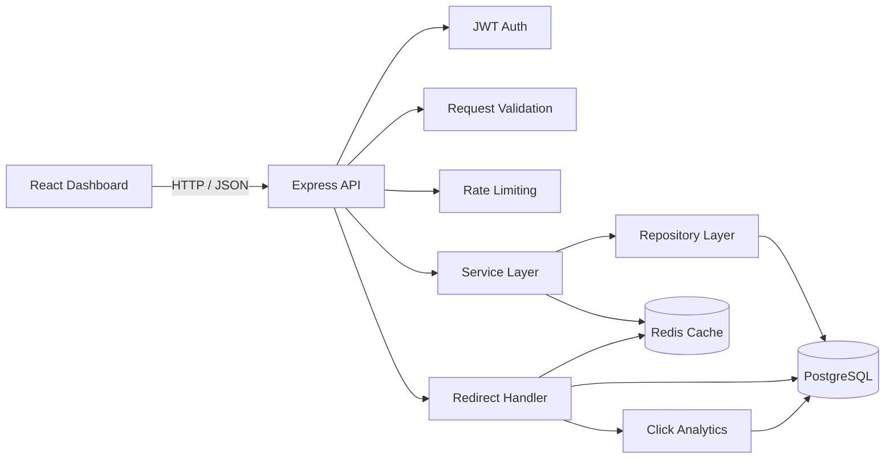

# URL Shortener

A full-stack URL shortening platform built to explore the engineering problems behind a real link service: persistent storage, fast redirects, authentication, authorization, caching, analytics, rate limiting, pagination, testing, and containerized development.

The backend is written in **TypeScript + Node.js + Express**, backed by **PostgreSQL and Redis**. The frontend is a **React + TypeScript** dashboard.

> This repository is intentionally focused on core backend and full-stack engineering rather than adding features for the sake of feature count.

## What it does

- Creates short URLs with automatically generated short codes
- Supports user-defined custom aliases
- Handles generated short-code collisions
- Validates submitted URLs and expiration dates
- Redirects short links with HTTP 302
- Supports optional URL expiration
- Records click events and request metadata
- Provides per-URL analytics
- Supports user registration and login
- Hashes passwords with bcrypt
- Protects API routes with JWT authentication
- Enforces URL ownership for protected operations
- Caches URL resolution in Redis
- Falls back to PostgreSQL when Redis is unavailable
- Rate-limits URL creation
- Supports updating and deleting owned URLs
- Provides paginated URL listings
- Includes a React dashboard for URL management and analytics
- Exposes interactive Swagger/OpenAPI documentation
- Includes automated backend tests with Jest and Supertest
- Runs the backend stack with Docker Compose

## Architecture



The backend is organized around a simple separation of responsibilities:

```text
HTTP Request
    |
    v
Route / Middleware
    |
    +--> Authentication
    +--> Validation
    +--> Rate Limiting
    |
    v
Service Layer
    |
    v
Repository Layer
    |
    +--> PostgreSQL
    +--> Redis (where caching is useful)
```

This keeps HTTP concerns, application logic, and database access from becoming tightly coupled.

---

## Redirect flow

Redirects are the latency-sensitive path of the application.

```text
GET /:shortCode
      |
      v
  Redis lookup
      |
   +--+----------------+
   |                   |
 Cache hit          Cache miss
   |                   |
   |                   v
   |              PostgreSQL
   |                   |
   |              populate cache
   |                   |
   +--------+----------+
            |
            v
     record click event
            |
            v
      HTTP 302 redirect
```

Redis is treated as a **cache, not the source of truth**. If Redis is unavailable, the application can continue resolving URLs from PostgreSQL.

That distinction is important: caching improves the hot read path without making the redirect path dependent on a single cache service.

---

## URL lifecycle

### Create

```text
POST /urls
    |
    v
JWT authentication
    |
    v
Zod validation
    |
    v
URL service
    |
    +--> custom alias?
    |       |
    |       +--> validate + enforce uniqueness
    |
    +--> generated code
    |       |
    |       +--> retry on collision
    |
    v
PostgreSQL
    |
    v
JSON response
```

### Update

An authenticated owner can update the destination URL and expiration date of an existing short URL.

### Delete

An authenticated owner can delete an owned short URL. Associated click events are removed through the database foreign-key relationship.

### Expiration

Expired links return **HTTP 410 Gone** rather than redirecting to the original destination.

---

## Analytics

Each successful short-link resolution records a click event.

The click record contains:

- URL identifier
- Timestamp
- IP address
- User-Agent
- Referrer

The application also maintains a click count on the URL record for lightweight aggregate access.

Analytics endpoints are protected by authentication and ownership checks, so one user cannot inspect another user's link statistics.

---

## Pagination

The dashboard does not load every URL into memory.

The API supports:

```text
GET /urls?limit=5&offset=0
```

Supported constraints:

- `limit`: integer from 1 to 100
- `offset`: non-negative integer

The PostgreSQL query uses:

- `LIMIT`
- `OFFSET`
- `COUNT(*) OVER()`

The window count allows the API to return both:

1. the current page of URLs
2. the total number of matching URLs

without running a separate count query for every request.

The React dashboard uses that total to render page navigation.

---

## Authentication and authorization

Authentication uses signed JWT access tokens.

### Registration

```text
POST /auth/register
```

Creates a user after validating the supplied credentials and hashing the password with bcrypt.

### Login

```text
POST /auth/login
```

Returns an access token and the authenticated user's basic information.

### Current user

```text
GET /auth/me
Authorization: Bearer <token>
```

### Ownership

URLs are associated with their owner. Protected operations verify the authenticated user's identity before returning or modifying user-owned resources.

This ownership boundary is applied to:

- URL listing
- URL creation
- URL update
- URL deletion
- URL analytics

---

## API surface

| Method | Endpoint | Auth | Purpose |
|---|---|---:|---|
| GET | `/health` | No | Health check |
| POST | `/auth/register` | No | Register a user |
| POST | `/auth/login` | No | Authenticate a user |
| GET | `/auth/me` | Yes | Get authenticated user |
| POST | `/urls` | Yes | Create a short URL |
| GET | `/urls` | Yes | List owned URLs |
| PUT | `/urls/:shortCode` | Yes | Update an owned URL |
| DELETE | `/urls/:shortCode` | Yes | Delete an owned URL |
| GET | `/urls/:shortCode/analytics` | Yes | Get URL analytics |
| GET | `/:shortCode` | No | Redirect to original URL |
| GET | `/docs` | No | Swagger API documentation |

### Example paginated response

```json
{
  "urls": [
    {
      "id": 42,
      "shortCode": "aB7xK2",
      "originalUrl": "https://example.com/article",
      "createdAt": "2026-09-30T10:00:00.000Z",
      "expiresAt": null,
      "clickCount": 17,
      "customAlias": null
    }
  ],
  "pagination": {
    "limit": 5,
    "offset": 0,
    "count": 21
  }
}
```

---

## Data model

The core persistent model is built around URLs and click events.

### URLs

Stores:

- generated short code
- original URL
- optional custom alias
- creation timestamp
- optional expiration timestamp
- aggregate click count
- owning user

Important database constraints/indexes include:

- unique short code
- unique non-null custom alias
- expiration index
- user ownership/indexing used by the application

### Click events

Stores:

- URL reference
- click timestamp
- IP address
- user agent
- referrer

The click table uses a foreign key with cascade deletion so deleting a URL also removes its associated click events.

---

## Why PostgreSQL + Redis?

### PostgreSQL

PostgreSQL is the system of record because the application needs:

- durable URL storage
- relational ownership
- uniqueness constraints
- foreign keys
- indexed queries
- click-event persistence
- transactional database semantics

### Redis

Redis is used for the frequently accessed redirect path.

A short URL can be requested many times while its underlying record changes relatively infrequently. Caching that lookup avoids repeatedly hitting PostgreSQL for the same hot URL.

The design deliberately keeps Redis optional for correctness: PostgreSQL remains capable of resolving a URL when the cache is unavailable.

---

## Backend structure

```text
src/
├── config/
│   ├── database.ts
│   ├── env.ts
│   ├── redis.ts
│   └── swagger.ts
│
├── database/
│   └── schema.sql
│
├── middleware/
│   ├── asyncHandler.ts
│   ├── auth.ts
│   ├── errorHandler.ts
│   └── rateLimit.ts
│
├── repositories/
│   ├── urlRepository.ts
│   └── userRepository.ts
│
├── routes/
│   ├── analytics.ts
│   ├── auth.ts
│   ├── health.ts
│   ├── redirect.ts
│   └── url.ts
│
├── schemas/
│   └── urlSchema.ts
│
├── services/
│   ├── analyticsService.ts
│   ├── authService.ts
│   ├── passwordService.ts
│   ├── rateLimiter.ts
│   ├── tokenService.ts
│   ├── urlCache.ts
│   └── urlService.ts
│
├── types/
├── utils/
├── __tests__/
├── app.ts
└── server.ts
```

### Frontend structure

```text
frontend/src/
├── api/
├── assets/
├── App.tsx
├── App.css
├── index.css
└── main.tsx
```

---

## Technology stack

### Backend

- **TypeScript**
- **Node.js 20**
- **Express 5**
- **PostgreSQL 17**
- **Redis 7**
- **JWT**
- **bcrypt**
- **Zod**
- **Swagger UI / OpenAPI**

### Frontend

- **React 19**
- **TypeScript**
- **Vite**

### Testing

- **Jest**
- **Supertest**

### Infrastructure

- **Docker**
- **Docker Compose**

---

## Testing

The backend test suite covers the application's important behavioral boundaries.

Current test areas include:

- authentication
- authorization
- URL ownership
- URL lifecycle
- validation
- error handling
- health checks
- Redis failure behavior

Run the backend tests:

```bash
npm test
```

The current suite contains **28 passing tests across 8 test suites**.

Build the backend:

```bash
npm run build
```

Build the frontend:

```bash
cd frontend
npm run build
```

---

## Local development

### Requirements

- Node.js 20+
- Docker
- Docker Compose

### 1. Clone

```bash
git clone https://github.com/hetram1/url-shortener.git
cd url-shortener
```

### 2. Configure environment

Create a root `.env` file containing the application configuration required by the backend.

At minimum, the application expects configuration for:

```text
PORT
DATABASE_URL
REDIS_URL
JWT_SECRET
```

Do not commit real secrets. The repository ignores `.env` files.

### 3. Start PostgreSQL, Redis, and the API

```bash
docker compose up -d --build
```

The Docker setup exposes:

| Service | Container | Host |
|---|---:|---:|
| API | 3001 | 3001 |
| PostgreSQL | 5432 | 5433 |
| Redis | 6379 | 6380 |

### 4. Run the frontend

```bash
cd frontend
npm install
npm run dev
```

The development dashboard is available at:

```text
http://localhost:5173
```

The API is available at:

```text
http://localhost:3001
```

Swagger documentation:

```text
http://localhost:3001/docs
```

---

## Docker architecture

The Compose setup contains three services:

```text
┌──────────────────────┐
│      React/Vite      │
│   localhost:5173     │
└──────────┬───────────┘
           │
           │ HTTP
           v
┌──────────────────────┐
│      Express API     │
│   localhost:3001     │
└───────┬────────┬─────┘
        │        │
        v        v
┌────────────┐ ┌────────────┐
│ PostgreSQL │ │   Redis    │
│   :5433    │ │   :6380    │
└────────────┘ └────────────┘
```

PostgreSQL and Redis use named Docker volumes so their data survives container recreation.

---

## Engineering decisions

### Collision handling

Generated short codes are not assumed to be collision-free.

The creation path handles database uniqueness conflicts and retries generated-code creation when necessary.

Custom aliases use a database-level uniqueness constraint so concurrent requests cannot create duplicate aliases.

### Cache failure handling

Redis improves performance but is not required for correctness.

If Redis operations fail, the application can fall back to PostgreSQL for URL resolution.

This makes the cache a performance layer rather than a single point of failure for redirects.

### Database-level pagination

Pagination is performed by PostgreSQL instead of retrieving the entire URL collection and slicing it in application memory.

This keeps the amount of data transferred from the database proportional to the requested page.

### Layered backend design

The project separates:

```text
Routes
  ↓
Services
  ↓
Repositories
  ↓
Database
```

The result is easier to reason about, test, and extend than placing authentication, business rules, SQL, and HTTP handling inside one large route handler.

### Ownership enforcement

Authentication answers:

> "Who is making this request?"

Authorization answers:

> "Is this user allowed to access this resource?"

The project explicitly handles both. A valid JWT alone does not grant access to another user's URLs.

---

## Security considerations

The application includes several baseline protections:

- bcrypt password hashing
- JWT authentication
- authenticated protected routes
- resource ownership checks
- URL input validation
- custom-alias validation
- URL creation rate limiting
- database uniqueness constraints
- centralized error handling
- environment-based secret configuration

This project is an engineering exercise and should not be treated as a security-audited production service.

Before public deployment, production configuration should use strong secrets, HTTPS, appropriate CORS policy, secure cookie/token handling where applicable, operational logging, monitoring, and infrastructure-level protections.

---

## Performance considerations

The main hot path is short-link resolution.

The current design reduces repeated database work through Redis caching while keeping PostgreSQL as the persistent source of truth.

For larger workloads, natural next steps would include:

- database connection-pool tuning
- more targeted indexes based on production query patterns
- cursor-based pagination for very large URL collections
- cache invalidation strategy refinement
- asynchronous click-event processing
- horizontal API scaling
- centralized rate limiting
- observability and metrics
- load testing and capacity measurement

These are deliberately not presented as implemented features.

---

## Repository philosophy

The implementation prioritizes understandable engineering decisions over artificial complexity.

The project is intended to demonstrate that a developer can reason about:

- API boundaries
- data modeling
- authentication
- authorization
- caching
- failure modes
- database constraints
- pagination
- testing
- containerization
- frontend/backend integration

rather than simply assembling a large collection of frameworks.

---

## Future extensions

Potential extensions, if the system needed to evolve further:

- cursor-based pagination
- background analytics processing
- richer analytics aggregation
- link tags and search
- QR-code generation
- custom domains
- API keys for programmatic clients
- structured application logging
- metrics and tracing
- CI/CD
- load testing
- horizontal deployment

These are **future ideas, not current capabilities**.

---

## Project status

The current implementation includes the core URL-shortening workflow end to end:

```text
Authentication
     ↓
Create URL
     ↓
Persist
     ↓
Cache
     ↓
Redirect
     ↓
Record click
     ↓
Analyze
     ↓
Manage from dashboard
```

The project currently has a clean working tree and the backend test suite passes with **28 tests across 8 suites**.

---

## License

No license has been added to the repository yet.
